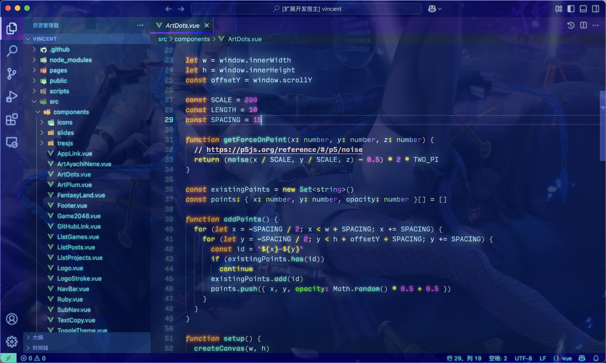

<div align="center">
    
</div>
<h1 align="center">VSCode Theme Jinx</h1>
<p align="center">Yet another VSCode glowing theme.</p>

<p align="center">
<a href="https://marketplace.visualstudio.com/items?itemName=vincent-the-gamer.jinx" target="__blank"></a>
</p>

<p align="center">
    <b><i>There's a「Jinx」on your computer, lol😄.</i></b>
</p>

# Installation

Search `jinx` in VSCode extension menu.

# Animation (v0.1.6)

From `v0.1.6`, Jinx supports **animations** by default, and you can have `cursor trailing effect` by adding dist/trail.js to `jinx.imports`.

```json
"jinx.imports": [
    "file://<UserFolder>/.vscode/extensions/vincent-the-gamer.jinx-{plugin-version}/glow.css",
    "file://<UserFolder>/.vscode/extensions/vincent-the-gamer.jinx-{plugin-version}/dist/trail.js"
],
```

To get better cursor effect, add these to `settings.json`

```json
"editor.cursorBlinking": "solid",
"editor.cursorWidth": 3,
"editor.cursorSmoothCaretAnimation": "on"
```

https://github.com/user-attachments/assets/4a780545-09c3-4ede-a4b1-e1a52308fce1


# Enable Glowing Effect

Provide your path to `glow.css` in `settings.json`.

> [!WARNING]
> `file://` is required!!!!

macOS:

```json
"jinx.imports": [
    "file:///Users/{USER_NAME}/.vscode/extensions/vincent-the-gamer.jinx-{plugin-version}/glow.css"
],
```

Windows: 
```json
"jinx.imports": [
    "file://C:/Users/{USER_NAME}/.vscode/extensions/vincent-the-gamer.jinx-{plugin-version}/glow.css"
],
```

Linux:

```json
"jinx.imports": [
    "file:///home/{USER_NAME}/.vscode/extensions/vincent-the-gamer.jinx-{plugin-version}/glow.css"
],
```

Then, run `Enable Jinx Glowing`

- `Ctrl + Shift + P` or `Command + Shift + P`
- Input `enable jinx glowing`

And happy hacking~~~ ☆´∀｀☆

# Change font

If you like the font I'm using, you can download it:

Input Mono: https://input.djr.com/

# Add a background image

Please use [Background](https://github.com/shalldie/vscode-background) extension.

Download pic from the top of this document, then add these codes to `settings.json`.
```json
"background.fullscreen": {
    "images": ["file:///path/to/pic"],
    "opacity": 0.18,
    "size": "cover",
    "position": "center",
    "interval": 0
},
"background.editor": {
    "background-position": "100% 100%",
    "background-size": "cover",
    "opacity": 0.3
},
```

Additionally, change your comment color.
```json
"editor.tokenColorCustomizations": {
    "comments": {
        "foreground": "#ffd9c4",
        "fontStyle": "bold"
    }
},
```

Then your Code will look like my preview pic.


# Preview

## Normal


## Glowing


# Publish
```shell
pnpm run build
pnpm run publish
```

# Changelog
View [Changelog](./CHANGELOG.md)

# License
[MIT](./LICENSE)
