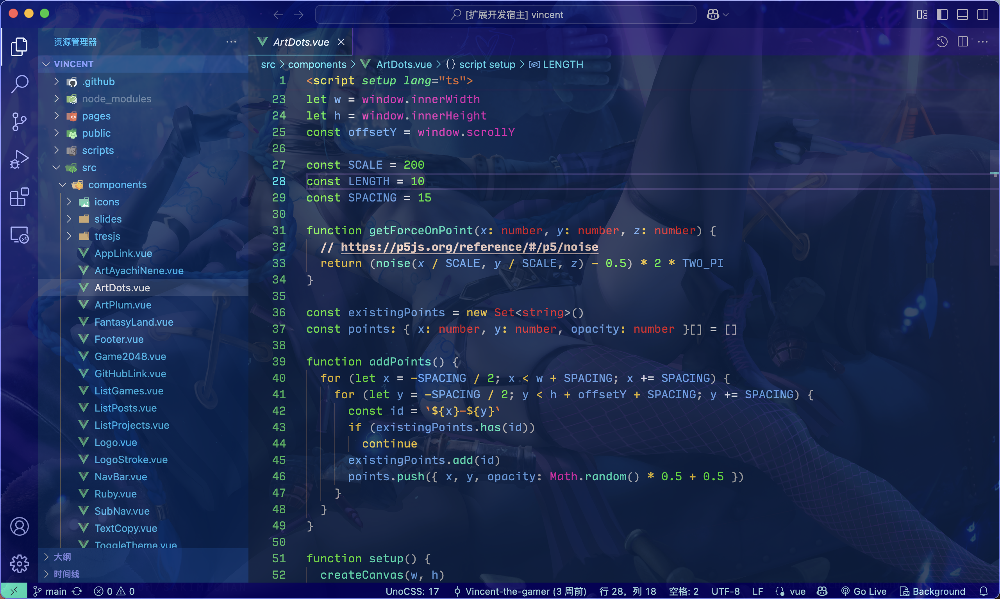

<h1 align="center">VS Code Theme Jinx</h1>
<p align="center">Yet another VSCode glowing theme.</p>

<p align="center">
<a href="https://marketplace.visualstudio.com/items?itemName=vincent-the-gamer.jinx" target="__blank"></a>
</p>

<!-- <p align="center">
    <b><i>Let the neon lights colorize your heart. (๑•̀ㅂ•́)و✧</i></b>
</p> -->

# Installation

Search `jinx` in VS Code extension menu.

# Enable Glowing Effect

Provide your path to `glow.css` in `settings.json`.

> [!WARNING]
> `file://` is required!!!!

macOS:

```json
"jinx.imports": [
    "file:///Users/{USER_NAME}/.vscode/extensions/vincent-the-gamer.jinx-{plugin-version}/glow.css"
],
```

Windows: 
```json
"jinx.imports": [
    "file://C:/Users/{USER_NAME}/.vscode/extensions/vincent-the-gamer.jinx-{plugin-version}/glow.css"
],
```

Linux:

```json
"jinx.imports": [
    "file:///home/{USER_NAME}/.vscode/extensions/vincent-the-gamer.jinx-{plugin-version}/glow.css"
],
```

Then, run `Enable Jinx Glowing`

- `Ctrl + Shift + P` or `Command + Shift + P`
- Input `enable jinx glowing`

    

And happy hacking~~~ ☆´∀｀☆

# Preview

## Normal


## Glowing


# Publish
```shell
pnpm run build
pnpm run publish
```

# Changelog
View [Changelog](./CHANGELOG.md)

# License
[MIT](./LICENSE)
